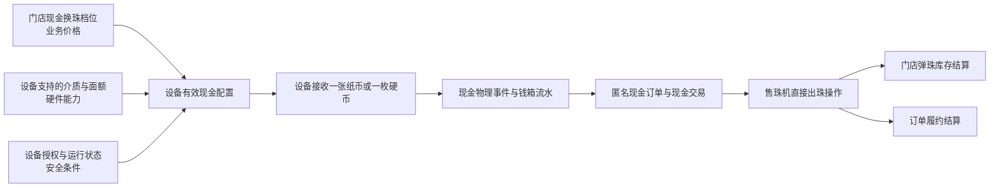
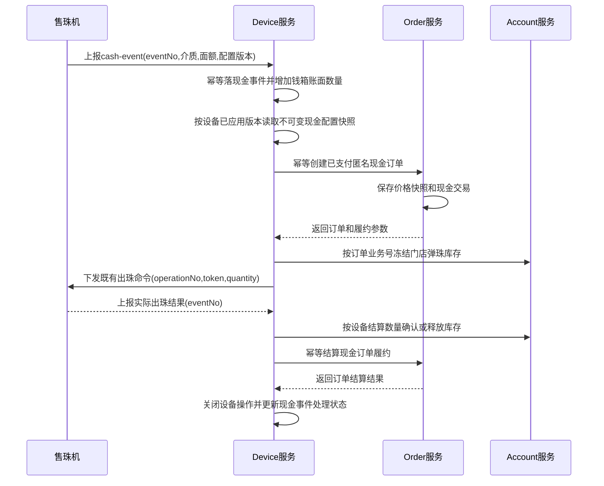

# 售珠机现金直售长期方案

> 文档状态：开发实施基线
> 编制日期：2026-07-27
> 适用范围：尚未上线的开发环境，按最终模型实现，不保留旧现金原型兼容逻辑。

## 1. 目标

在售珠机上支持纸币和硬币匿名购珠。用户投入设备已启用的单张纸币或单枚硬币后，系统按当前门店明确配置的现金换珠档位创建现金订单，并由当前设备直接出珠。

第一阶段不找零、不累计多枚现金、不进入会员账户。系统必须完整记录现金物理事实、匿名订单、钱箱变化、门店弹珠库存变化和设备出珠结果；已收钱但出珠结果不明确时必须进入人工处理，不能套用线上退款逻辑。

## 2. 最终业务边界

1. 现金购珠是匿名即时购珠，`member_id` 为空。
2. 现金购珠不创建会员弹珠账户入账，不复用一次性套餐。
3. 现金价格不按线上购珠规则的单位价格实时计算。
4. 门店通过独立现金档位明确配置“现金金额 -> 出珠数量”，例如 `1000分 -> 100颗`、`2000分 -> 300颗`。
5. 相同金额的纸币和硬币使用同一个业务价格；介质差异只属于设备现金接收能力。
6. 第一阶段一次现金接收事件只允许一张纸币或一枚硬币，并对应一张匿名订单和一次出珠操作。
7. 第一阶段不找零，设备不得接受没有有效现金档位的面额。
8. 现金实际进入或离开钱箱，以设备现金事件为准，不以订单状态推断。
9. 现金已投入但未足量出珠时，不自动调用微信退款，也不虚构会员补取凭证。
10. 同一设备存在未解决硬件操作时必须关闭现金接收能力。

线上购珠固定档位和现金档位可以配置相同内容，但两者是不同渠道的独立规则，生命周期和启停条件不能互相影响。

## 3. 核心设计



服务端配置分为三层：

- 业务价格：门店愿意用某个现金金额出售多少颗弹珠。
- 硬件能力：某台设备能够识别和接收哪些纸币、硬币面额。
- 有效配置：价格档位、设备面额能力、现金配置开关和直购授权的交集。

设备只接收服务端下发的有效配置。数据库不能把出珠数量直接写入设备面额表，否则门店价格会和设备硬件能力耦合。门店弹珠库存、设备在线状态和活动操作属于运行时开放条件，不固化进价格或配置快照。

## 4. 模块职责

| 模块 | 职责 |
| --- | --- |
| `module-package` | 维护门店现金换珠规则和档位，按现金金额返回服务端报价 |
| `module-device` | 维护设备面额能力、接收现金事件、记录钱箱库存、编排设备出珠 |
| `module-order` | 创建匿名现金订单、保存现金价格快照、记录现金交易、处理履约结算 |
| `module-account` | 冻结并结算门店游戏物料库存，不操作会员账户 |
| `module-finance` | 根据已确认现金交易和订单形成经营流水，不替代钱箱实物账 |
| 商家小程序 | 配置现金档位和设备面额，查询钱箱与现金订单，处理异常 |
| 会员小程序 | 不承载匿名现金购珠流程 |

现金投入事件来自设备，入口编排由 `module-device` 发起；业务价格仍由 `module-package` 提供，订单和支付事实由 `module-order` 持有。任何模块不得跨库直接修改其他模块的数据表。

## 5. 现金换珠价格模型

### 5.1 `marble_cash_sale_rule`

门店现金换珠规则主表。同一门店、同一游戏物料只维护一条当前未删除规则；规则停用后继续修改原聚合，逻辑删除后才允许重新创建。这样商家端不会出现多条待选规则，同时保留历史业务编号和订单快照的可追溯性。

| 字段 | 说明 |
| --- | --- |
| `id` | 主键 |
| `tenant_id` | 租户ID |
| `store_id` | 门店ID |
| `item_id` | 游戏物料ID，只允许启用的弹珠物料 |
| `rule_no` | 不可复用的业务规则编号 |
| `status` | `0=停用 1=启用` |
| `version` | 乐观锁版本；档位变化时主规则版本同步递增 |
| `is_deleted` | 逻辑删除标记 |
| `current_item_id` | 当前未删除规则的物料唯一键，逻辑删除后为空 |
| `create_time/update_time` | 创建和更新时间 |

规则启用条件：

- 至少存在一个启用档位。
- 所有金额和出珠数量为正整数。
- 同一规则内现金金额不可重复。
- Package 域不反向依赖设备能力；Device 域发布设备现金配置时按设备物理出珠范围过滤，不兼容设备不会获得对应档位。

### 5.2 `marble_cash_sale_tier`

现金金额与出珠数量的明确映射。

| 字段 | 说明 |
| --- | --- |
| `id` | 主键 |
| `tenant_id` | 租户ID |
| `rule_id` | 现金换珠规则ID |
| `tier_no` | 不可复用的档位业务编号 |
| `cash_amount` | 收款金额，单位分 |
| `marble_quantity` | 对应出珠数量 |
| `sort_order` | 商家端显示顺序 |
| `status` | `0=停用 1=启用` |
| `version` | 乐观锁版本 |
| `is_deleted` | 逻辑删除标记 |
| `create_time/update_time` | 创建和更新时间 |

业务运行时只按明确档位报价，不使用 `marble_purchase_rule.unit_price_amount` 反算。单位价格可以用于商家端生成建议数量，但建议值保存为档位后才生效。

### 5.3 为什么不复用线上固定档位表

线上固定档位属于会员支付场景，支持存入账户或设备立即出珠，并依赖微信支付状态。现金档位属于设备先收取实物现金的匿名场景，依赖面额能力、钱箱事件和无线上退款的异常处理。

两者复用同一张档位表会导致渠道启停、设备同步、退款策略和历史快照相互耦合。独立建模可以允许门店配置：

- 线上 `20元 = 220颗`，现金 `20元 = 200颗`；
- 线上档位继续销售，但某台设备暂停接收20元纸币；
- 现金活动结束时只停用现金规则，不影响会员线上购珠。

## 6. 设备现金能力模型

### 6.1 `marble_vending_machine_cash_configuration`

每台售珠机保存一条现金配置聚合根，只管理现金接收开关和配置发布状态，不承载线上购珠、存珠、取珠或核销等其他业务开关：

| 字段 | 说明 |
| --- | --- |
| `id` | 主键 |
| `tenant_id/store_id/device_id/item_id` | 设备归属和本次现金直售物料 |
| `cash_acceptance_enabled` | 商家是否允许该设备接收现金 |
| `configuration_version` | 服务端最新发布版本，从1开始单调递增 |
| `applied_configuration_version` | 设备明确确认已应用的版本，未应用时为0 |
| `last_publish_time/last_applied_time` | 最近发布和设备应用时间 |
| `version` | 乐观锁版本 |
| `create_time/update_time` | 创建和更新时间 |

唯一键为 `device_id`。现金规则、现金档位、设备面额、直购授权或设备物料发生变化时，由 Device 服务重新计算有效项，在同一事务中递增 `configuration_version` 并写入该版本的不可变快照。只有 `applied_configuration_version = configuration_version` 时，设备才能开放现金器。

这张表不复用旧原型 `marble_vending_machine_configuration`。现行购买、存珠、取珠和核销已经分别由购珠规则、门店存取规则、设备授权策略和操作单表达，重新建设一个全功能总配置表会形成重复开关和不清晰的事实源。

### 6.2 `marble_vending_machine_cash_denomination`

描述设备现金器能够处理的介质和面额，不保存出珠数量。

| 字段 | 说明 |
| --- | --- |
| `id` | 主键 |
| `tenant_id/store_id/device_id` | 设备归属快照 |
| `cash_medium_type` | `1=纸币 2=硬币` |
| `denomination_amount` | 面额，单位分 |
| `acceptance_enabled` | 是否允许收款 |
| `payout_enabled` | 是否允许钱箱主动退币或找零；第一阶段固定关闭 |
| `capacity_count` | 该介质面额的钱箱容量，0表示未配置 |
| `near_capacity_warning_count` | 临近满箱预警阈值 |
| `low_balance_warning_count` | 找零库存不足阈值；第一阶段保留为0 |
| `version` | 乐观锁版本 |
| `is_deleted` | 逻辑删除标记 |
| `create_time/update_time` | 创建和更新时间 |

唯一键为 `device_id + cash_medium_type + denomination_amount`。

旧原型名 `marble_vending_machine_cash_denomination_configuration` 不再作为最终表名。表本身已经明确表达设备现金面额配置，去掉冗长的 `configuration` 后缀。

### 6.3 有效现金配置

服务端向设备下发的每个有效项包含：

- `cashMediumType`
- `denominationAmount`
- `marbleQuantity`
- `cashSaleTierNo`
- `enabled`

有效项必须同时满足：

```text
门店现金规则已启用
现金档位已启用
设备面额允许收款
设备现金支付业务开关已启用
设备直接购珠授权已启用
档位数量符合售珠机协议允许的单次出珠范围
现金配置版本已成功应用
```

有效配置由 `marble_vending_machine_cash_configuration.configuration_version` 独立管理。价格域不直接修改设备域数据；现金规则发生变化后通过领域事件或可靠补偿任务触发相关设备重新发布配置。设备回报相同 `applied_configuration_version` 后才能重新开放现金器。

### 6.4 `marble_vending_machine_cash_configuration_snapshot`

设备可能在配置变更前已经接收现金，但事件因断网延迟到配置变更后才上报。此时必须按设备接收现金时实际应用的配置结算，不能查询当前现金档位重新报价。

每次生成设备有效现金配置时，按有效介质和面额写入不可变快照：

| 字段 | 说明 |
| --- | --- |
| `id` | 主键 |
| `tenant_id/store_id/device_id/item_id` | 配置归属和弹珠物料 |
| `item_code/item_name/unit_name` | 物料编码、名称和计量单位快照，历史现金订单不得反查当前物料补齐 |
| `cash_configuration_id` | 现金配置聚合根ID |
| `configuration_version` | 本次下发的设备配置版本 |
| `cash_medium_type` | 纸币或硬币 |
| `denomination_amount` | 面额，单位分 |
| `cash_sale_rule_id/cash_sale_rule_no` | 现金规则来源快照 |
| `cash_sale_rule_version` | 生成配置时的现金规则版本 |
| `cash_sale_tier_id/cash_sale_tier_no` | 现金档位来源快照 |
| `cash_sale_tier_version` | 生成配置时的现金档位版本 |
| `cash_amount` | 本次应收金额，单位分 |
| `marble_quantity` | 本次应出数量 |
| `create_time` | 快照生成时间 |

唯一键为 `device_id + configuration_version + cash_medium_type + denomination_amount`。快照只新增不修改；现金事件必须使用 `device_id + configuration_version + cash_medium_type + denomination_amount` 命中快照，并再次核对 `cash_sale_tier_no`。

## 7. 现金物理事实与钱箱

### 7.1 `marble_vending_machine_cash_event`

现金事件是设备物理事实和消息幂等入口。现金被设备确认接收后，即使订单创建失败，也必须先落现金事件并更新钱箱账面数量。

`accepted` 必须表示纸币或硬币已经不可逆进入收款钱箱，不表示现金器仅检测到、验证中或仍处于可退回的暂存通道。暂存阶段失败或拒收不形成收款订单和钱箱增加；现金进入钱箱后的主动退回必须上报独立 `returned` 事件。第一阶段关闭主动找零能力，不影响现金器在入箱前拒收并原路退出。

| 字段 | 说明 |
| --- | --- |
| `id` | 主键 |
| `tenant_id/store_id/device_id` | 设备归属 |
| `event_no` | 设备生成的全局稳定事件号 |
| `event_type` | `1=接收 2=退回 3=钱箱快照` |
| `cash_medium_type` | `1=纸币 2=硬币` |
| `denomination_amount` | 面额，单位分 |
| `cash_count` | 本次张数或枚数；第一阶段接收事件必须为1 |
| `configuration_version` | 设备处理现金时使用的配置版本 |
| `cash_sale_tier_no` | 设备有效配置中的现金档位编号 |
| `processing_status` | `0=已接收 1=订单已创建 2=出珠中 3=已完成 4=待人工处理` |
| `order_id/order_no` | 后续绑定的匿名订单，可为空 |
| `operation_id/operation_no` | 后续绑定的设备操作，可为空 |
| `result_code/result_message` | 编排结果或异常原因 |
| `payload` | 原始报文，仅用于审计 |
| `event_time/create_time/update_time` | 设备时间、接收时间和更新时间 |

唯一键为 `device_id + event_no`。重复上报只能返回已存在结果，不得重复增加钱箱数量、创建订单或出珠。

### 7.2 `marble_vending_machine_cash_inventory`

每台设备按介质和面额保存钱箱账面数量：

- `current_count`：平台根据已确认现金事件计算的账面数量。
- `reported_count`：设备最近一次上报数量。
- `last_report_time`：最近设备快照时间。
- `last_reconcile_time`：最近人工清点或盘点时间。
- `version`：并发控制版本。

唯一键为 `device_id + cash_medium_type + denomination_amount`。账面数量和设备上报数量不一致时生成差异告警，不静默覆盖。

### 7.3 `marble_vending_machine_cash_inventory_log`

钱箱每次变化写不可变流水：

| 变动类型 | 说明 |
| --- | --- |
| `CASH_ACCEPTED` | 设备确认接收现金，数量增加 |
| `CASH_RETURNED` | 设备确认退回现金，数量减少 |
| `CASHBOX_CLEAR` | 商家清箱，数量减少 |
| `CASHBOX_REFILL` | 将现金放入找零钱箱；第一阶段不使用 |
| `INVENTORY_RECONCILIATION` | 盘点校准 |
| `REVERSAL` | 对错误流水进行显式冲正 |

流水保存 `event_no`、订单和操作关联、介质、面额、变化数量及前后数量。不得通过直接修改库存表代替流水。

## 8. 订单与现金交易模型

### 8.1 `order_info`

现金接收已是支付成功事实，因此现金订单创建后直接进入 `PAID_PENDING_FULFILLMENT`：

- `order_type = MARBLE_PURCHASE`
- `member_id = NULL`
- `device_id = 当前售珠机`
- `pay_channel = CASH`
- `order_amount = pay_amount = 现金档位金额`
- `discount_amount = 0`
- `pay_time = 现金接收时间`
- `biz_no = 设备ID + 现金事件号形成的稳定业务号`

现金订单不调用微信支付服务，不创建微信预支付单。`PayChannelEnum` 增加单一 `CASH` 渠道，纸币或硬币保存在现金交易快照中，不扩展为两个支付渠道。

### 8.2 `order_marble_purchase_detail`

购珠扩展表继续表达“购买弹珠以及如何履约”，但价格来源调整为互斥模型：

```text
pricing_source_type
1 = ONLINE_UNIT_PRICE
2 = ONLINE_FIXED_TIER
3 = CASH_FIXED_TIER
```

现金订单新增以下快照字段：

- `cash_sale_rule_id/cash_sale_rule_no`
- `cash_sale_rule_version`
- `cash_sale_tier_id/cash_sale_tier_no`
- `cash_sale_tier_version`

现金订单的线上购珠规则字段必须为空；线上订单的现金规则字段必须为空。现金实收、介质、面额和退回只保存在 `order_info` 与 `order_cash_transaction`，不在购珠扩展表重复保存。数据库检查约束必须验证三种价格来源互斥，不能保留“现金订单伪造一个线上购珠规则”的兼容写法。

### 8.3 `order_cash_transaction`

订单域保存现金支付和退回的业务事实，支持后续一张订单关联多次现金动作，但第一阶段每张订单只有一条接收交易。

| 字段 | 说明 |
| --- | --- |
| `id` | 主键 |
| `tenant_id/store_id/order_id/order_no/device_id` | 订单和设备归属 |
| `transaction_no` | 订单域现金交易号 |
| `device_event_no` | 对应设备现金事件号；线下退款时为空 |
| `related_transaction_id` | 退款或退回关联的原接收交易ID |
| `transaction_type` | `1=现金接收 2=设备退回 3=线下退款` |
| `cash_medium_type` | 纸币或硬币；线下退款时可为空 |
| `denomination_amount` | 单张或单枚面额，单位分；线下退款时可为空 |
| `cash_count` | 张数或枚数；线下退款时可为空 |
| `transaction_amount` | 本次金额，单位分 |
| `status` | `0=处理中 1=已确认 2=失败 3=待人工处理` |
| `transaction_time` | 设备实际处理时间 |
| `operator_type/operator_id` | 系统、设备或商家操作人 |
| `remark/create_time/update_time` | 说明和审计时间 |

唯一键至少包括 `device_id + device_event_no` 和 `transaction_no`。设备事件交易必须填写介质、面额和数量；线下退款必须关联原接收交易，且不得修改设备钱箱库存。该表是订单支付审计，不替代设备钱箱库存流水。

### 8.4 `order_cash_exception_resolution`（第四阶段设计，当前不建表）

现金订单进入人工处理后，由订单域保存一次不可变的最终解决记录：

| 字段 | 说明 |
| --- | --- |
| `id` | 主键 |
| `tenant_id/store_id/order_id/order_no/device_id` | 订单和设备归属 |
| `operation_id/operation_no/settlement_no` | 设备操作和最终结算关联 |
| `resolution_no` | 现金异常解决业务编号 |
| `resolution_type` | 线下退现、线下补珠、设备退币或按实际交付结案 |
| `requested_quantity` | 订单应出数量 |
| `device_reported_quantity` | 设备原始上报数量，可为空 |
| `settled_quantity` | 人工确认的最终业务交付数量 |
| `refund_amount` | 实际退还现金金额，单位分 |
| `remark` | 必填处理说明 |
| `operator_type/operator_id/resolved_time` | 操作人和处理时间 |
| `create_time` | 创建时间 |

一张现金订单最多一条最终解决记录。该表属于第四阶段异常处置功能，当前代码尚未提供人工解决入口，因此不在当前基线和迁移脚本中创建。线下补珠时，`settled_quantity` 包含设备出珠和线下补发总量，门店弹珠库存按最终结算数量处理；线下退现时同步新增 `OFFLINE_REFUND` 现金交易，但不减少设备钱箱账面数量。

### 8.5 财务边界

现金收入以已确认的 `order_cash_transaction` 和最终订单结果进入经营流水。钱箱库存回答“设备里有多少张或枚现金”，订单回答“这笔钱购买了什么”，财务流水回答“门店确认了多少经营收入”，三者不能合并。

## 9. 第一阶段业务流程



现金事件进入设备服务后，现金器立即保持关闭，直到订单和设备操作达到明确终态或人工处理完成。

## 10. MQTT协议

### 10.1 现金接收事件

主题建议：

```text
pxd/v1/device/{deviceNo}/report/cash-event
```

第一阶段接收报文：

```json
{
  "eventNo": "CE202607270001",
  "eventType": "accepted",
  "cashMediumType": "banknote",
  "denominationAmount": 1000,
  "cashCount": 1,
  "cashSaleTierNo": "CST202607270001",
  "configVersion": 18,
  "timestamp": 1785123456789
}
```

约束：

- `eventNo` 必须在设备生命周期内全局稳定，重启和断网重传不得改变。
- 金额统一使用整数分，不接受小数和元单位。
- 第一阶段 `cashCount` 必须等于1。
- `configVersion`、介质、面额和 `cashSaleTierNo` 必须共同命中服务端配置快照。
- 设备身份、租户和门店只从认证设备档案推导，不信任报文自带归属字段。
- 设备必须持久化未确认事件，收到服务端明确ACK前持续重传。

### 10.2 配置同步

设备收到的有效现金配置是服务端合并结果，不直接下发数据库表：

```json
{
  "configVersion": 18,
  "cashAcceptanceEnabled": true,
  "changeEnabled": false,
  "cashSaleItems": [
    {
      "cashMediumType": "banknote",
      "denominationAmount": 1000,
      "marbleQuantity": 100,
      "cashSaleTierNo": "CST202607270001"
    },
    {
      "cashMediumType": "coin",
      "denominationAmount": 100,
      "marbleQuantity": 10,
      "cashSaleTierNo": "CST202607270002"
    }
  ]
}
```

设备只在以下条件全部满足时开启现金器：MQTT在线、配置版本已应用、当前无活动操作、门店可用弹珠库存足以覆盖当前开放档位、现金器无故障、至少存在一个有效现金档位。真机若支持独立珠仓计数，再把珠仓遥测作为附加安全条件，但不得覆盖 Account 域的门店库存账。

### 10.3 出珠协议复用

现金订单继续复用现有指定数量出珠命令、操作令牌和出珠结果协议。现金介质和金额不放入出珠命令作为结算依据；出珠命令只关心操作号、订单来源、物料和请求数量。

## 11. 幂等与一致性

现金已经被设备接收后，系统不能依赖跨服务分布式事务。实现采用“本地事实先落库、下游接口幂等、失败任务补偿”的方式：

1. Device服务在单个本地事务中写入现金事件、增加钱箱库存并写库存流水。
2. Order服务以稳定 `biz_no` 幂等创建匿名订单。
3. Account服务以订单和库存预占业务号幂等冻结门店库存。
4. Device服务以现金事件绑定的订单作为唯一来源创建一次直接购珠操作。
5. 设备出珠回执继续使用 `device_id + event_no` 幂等。
6. 任何一步超时都保留当前状态，由补偿任务查询或重试，不创建第二张订单和第二次操作。

必须提供补偿扫描：

- 现金事件已接收但订单未创建；
- 订单已创建但库存未冻结；
- 库存已冻结但设备操作未启动；
- 设备结果明确但订单未结算；
- 钱箱事件与订单现金交易绑定缺失。

## 12. 异常与人工处理

| 场景 | 自动处理 |
| --- | --- |
| 重复现金事件 | 返回原处理结果，不重复记账或出珠 |
| 面额或配置版本不合法但现金已进入 | 保留现金事实，进入人工处理 |
| 订单创建超时 | 保留事件并补偿重试，现金器保持关闭 |
| 库存不足且现金已进入 | 第一阶段直接进入人工处理；后续仅在设备启用主动退币能力时尝试退回 |
| 设备明确零出珠 | 不发起线上退款，进入现金人工处理 |
| 设备部分出珠 | 记录实际数量，进入现金人工处理 |
| 设备结果未知或超时 | 不猜测数量，继续占用设备并进入人工处理 |
| 设备明确退回现金 | 收到独立退回事件后减少钱箱数量并关闭订单 |

现金人工处理必须额外记录解决方式：

```text
1 = OFFLINE_CASH_REFUND       线下退还现金
2 = OFFLINE_MARBLE_DELIVERY   线下补足弹珠
3 = DEVICE_CASH_RETURN        设备确认退回现金，第一阶段预留
4 = ACCEPT_ACTUAL_DELIVERY    双方确认按实际出珠结案
```

人工提交内容至少包含设备原始上报数量、最终业务交付数量、解决方式、退款金额、说明、操作人和操作时间。部分或零交付的匿名现金订单不能创建会员补取凭证。

订单在人工处理中保持 `PAID_PENDING_FULFILLMENT`，现金器和来源业务继续被占用。处理完成后：

- 设备或线下退还全部现金：订单进入 `REFUNDED`，现金交易记录退回方式；只有设备确认退币才减少平台钱箱数量。
- 已补足弹珠或双方确认实际交付：订单进入 `FULFILLED`；设备结算保留原始上报数量，购珠扩展表保存最终履约数量，现金异常解决表保存两者差异和处理方式。

## 13. 商家端体验

### 13.1 门店现金换珠规则

入口建议：`经营中心 -> 商品配置 -> 弹珠 -> 现金购珠`。

页面只展示现金金额和对应出珠数量，一行一个档位，支持新增、编辑、删除、排序和启停。单位紧跟数字，金额统一由前端以元展示、接口以分传输。

### 13.2 设备现金面额

入口建议：`设备详情 -> 业务配置 -> 现金接收`。

页面按纸币和硬币分组，配置设备可接收面额。每个面额展示对应的门店现金档位和出珠数量；没有业务档位或数量不符合设备能力时不可启用，并展示具体原因。

### 13.3 现金订单和钱箱

商家端需要提供：

- 现金购珠订单列表和详情；
- 设备、介质、面额、金额、应出数量和实际出珠数量；
- 钱箱按面额库存、临近满箱预警和最近上报差异；
- 清箱和盘点记录；
- 待人工处理现金订单入口。

清箱必须形成业务单和不可变流水，不提供直接编辑 `current_count` 的入口。

## 14. 数据约束与命名

1. 金额统一使用 `int` 和整数分，字段以 `_amount` 结尾。
2. 张数、枚数统一使用 `_count`；弹珠数量统一使用 `_quantity`。
3. 现金介质字段统一命名 `cash_medium_type`，不再使用含义宽泛的 `cash_type`。
4. 业务编号使用 `_no`，数据库主键和跨表关联使用 `_id`。
5. 所有核心表包含 `tenant_id`，查询和唯一键必须满足租户隔离。
6. 现金事件、现金交易和库存流水不允许物理删除。
7. 规则和配置使用逻辑删除及乐观锁；历史订单只读快照，不反查当前规则重新计算。
8. 规则档位唯一键：`rule_id + cash_amount`。
9. 设备面额唯一键：`device_id + cash_medium_type + denomination_amount`。
10. 现金事件唯一键：`device_id + event_no`。
11. 订单现金交易唯一键：`device_id + device_event_no`。

## 15. 实施顺序

### 第一阶段：最终表结构和价格服务

- 新建 `marble_cash_sale_rule`、`marble_cash_sale_tier`。
- 新建设备现金配置聚合根、面额能力、不可变发布快照、事件、钱箱库存和流水表。
- 重构 `order_marble_purchase_detail` 的互斥价格来源约束。
- 新建 `order_cash_transaction`；异常解决表随第四阶段人工处置入口一并创建。
- 将最终结构同步到基线SQL，旧现金原型脚本不再作为部署入口。

### 第二阶段：商家配置

- 门店现金档位配置。
- 设备现金面额能力配置。
- 生成并同步设备有效现金配置。

### 第三阶段：现金事件和匿名订单

- MQTT现金事件接入与幂等。
- 钱箱库存和流水。
- 匿名现金订单及门店库存冻结。
- 复用直接购珠出珠状态机。

### 第四阶段：异常闭环

- 现金事件补偿任务。
- 零出珠、部分出珠和未知结果人工处理。
- 线下退现、线下补珠和设备退币记录。
- 现金订单、钱箱和库存对账。

### 第五阶段：模拟联调与真机联调

- MQTT模拟器覆盖纸币、硬币、重复事件、断网重传、零出珠、部分出珠和超时。
- 验证现金、弹珠库存和订单三账一致。
- 真机到位后验证现金器禁用时机、事件持久化、钱箱计数和机械出珠。

找零、多枚累计支付和离线现金销售不在第一阶段实现。后续只能在现金事件和 `order_cash_transaction` 模型上扩展，不得绕过当前幂等与钱箱流水体系。

## 16. 测试与验收基线

至少覆盖：

1. 同一现金事件重复上报只生成一张订单、一次钱箱增加和一次出珠。
2. 10元纸币和10元硬币命中同一现金档位，但分别校验设备介质能力。
3. `10元=100颗、20元=300颗`不受线上单位价格变化影响。
4. 旧配置版本的现金事件延迟上报时，仍按设备当时应用的不可变快照创建订单。
5. 现金规则、设备面额、设备授权任一关闭后，有效配置不包含该项。
6. 现金已接收但服务调用超时后，可通过补偿任务继续原订单。
7. 足量出珠后订单完成，门店库存按实际数量减少。
8. 零出珠、部分出珠和未知结果不触发微信退款。
9. 设备明确退币后才减少钱箱账面数量。
10. 清箱按每种介质和面额生成前后数量准确的流水。
11. 租户、门店和设备归属不匹配时拒绝处理且不跨租户写账。
12. 设备存在其他活动操作时不能接收现金。
13. 配置版本未应用时设备不能开启现金器。

验收结束后必须满足：匿名订单金额、订单现金交易金额、钱箱库存变化金额、门店弹珠库存变化数量和设备最终出珠数量均可通过稳定业务号追溯。

## 17. 本轮确认结论

本方案确定以下长期规则：

- 现金业务价格与线上购珠规则彻底分开。
- 现金金额到出珠数量采用明确档位，不按单位价格运行时计算。
- 现金价格不区分纸币和硬币，设备能力区分介质和面额。
- 现金物理事件先于订单，是钱箱记账的唯一依据。
- 现金匿名订单复用直接购珠硬件履约，不复用会员账户和套餐。
- 第一阶段一张或一枚现金对应一张订单，不累计、不找零。
- 异常现金订单只走现金人工处理，不自动走线上退款或会员补取。

## 18. 2026-08-01 实现审计补充

本轮针对设备 bootstrap 与 MQTT 现金配置的状态语义进行了实现审计，确认并修正以下规则：

1. `cashAcceptanceEnabled` 是商家现金接收配置开关，只通过版本化
   `sync_cash_configuration` 指令交付设备并由设备持久化。
2. `cashSale.available` 是当前运行可用状态，不是商家配置开关。设备离线、忙碌、故障、未授权或
   配置未完成应用时均可为 `false`。
3. bootstrap 只有在 `applied_configuration_version = configuration_version` 时才允许现金购珠；
   仅判断已应用版本大于 0 会错误放行旧版本，当前实现已修正。
4. 设备离线或忙碌时，bootstrap 可以返回 `available=false`，同时保留已应用版本和档位供展示、
   核对及现金事件字段取值。设备不得把运行态不可用写回成商家关闭配置。
5. bootstrap 已通过 Account 域只读接口检查门店物料库存，并按已应用现金档位中的最大出珠数量门控。
   库存未初始化、库存不足或库存服务不可用时均故障关闭，返回 `available=false` 和具体原因。

库存门控是收现前的运行安全检查，不是库存承诺。bootstrap 返回后库存仍可能被其他业务占用，因此现金
事件处理阶段的原子库存预占仍是最终权威校验，不能因 bootstrap 曾返回可用而跳过。

现金配置一致性闭环已经按长期方案实现：

1. Product 域的规则创建、档位替换、启停和删除事务提交后，发送门店物料维度的规则变化提示；
2. Device 域收到提示后，定向查询相关设备并重算有效配置；
3. 直接购珠授权变更、批量变更和设备授权整体挂起后，事务提交后将设备加入去重重算队列；
4. Device 域每轮定时任务使用主键游标扫描所有商家已开启现金接收的配置，覆盖 MQ 丢失、服务重启、
   授权到期、未来授权开始生效以及 Product 暂时不可用后的恢复；
5. Product 变化消息只负责提高及时性，不承担唯一可靠性。发送失败不回滚已提交的价格规则，最终由
   Device 全量补偿扫描收敛。

重算后的有效配置严格取以下交集：

```text
商家 cash_acceptance_enabled
∩ 当前有效 DIRECT_PURCHASE 授权
∩ Product 当前启用现金规则和有效档位
∩ 设备当前启用的现金介质与面额
```

Device 服务比较最近一条现金配置指令时忽略 `configVersion`，只比较
`cashAcceptanceEnabled`、`changeEnabled` 和排序后的 `cashSaleItems`。有效载荷没有变化时不递增版本；
载荷变化、历史载荷损坏，或相同载荷的最新指令失败且超过退避时间时，才尝试重新发布。

重新发布在一个 Device 本地事务内完成：使用配置表 `version + configuration_version` 乐观锁递增发布
版本，写入该版本的不可变快照，并创建 `MARBLE_CASH_CONFIG` 设备命令。多实例同时计算时只有一个实例
能够更新成功，失败实例不创建重复快照和命令。新命令会取消仍待发送的旧现金配置命令；已经发送或已
形成终态的历史命令保留审计事实。

当授权撤销、授权到期、规则停用或有效档位交集为空时，服务端发布新的禁用版本：

```json
{
  "cashAcceptanceEnabled": false,
  "changeEnabled": false,
  "cashSaleItems": []
}
```

设备必须保存并应用这个更高版本，立即关闭验钞器，然后回执该 `configVersion`。授权恢复、规则恢复或
档位重新匹配后，服务端会再次发布新的启用版本。Product 服务暂时不可用时不根据旧数据猜测，也不立即
生成禁用版本；本轮重算失败并等待后续扫描，避免一次跨服务故障把仍在运行的配置错误改写。

该闭环是服务端配置一致性能力，设备仍不得通过金额、自有库存、bootstrap 或本地旧配置自行重建配置。
设备只应用版本化 `sync_cash_configuration` 指令，bootstrap 只负责当前运行可用门控。

本次一致性闭环不新增数据库表或增量 SQL。部署时需要确认 RocketMQ Topic `pxd_product` 可用，规则
变化使用 Tag `marble_cash_sale_rule_changed`，Device 消费组为 `GID_device_cash_rule_changed`。生产
Broker 若关闭自动创建 Topic，必须在发布 Product 和 Device 服务前由运维创建；Topic 暂时不可用不会
阻止规则事务提交，但重算及时性会退化为 Device 定时扫描。
